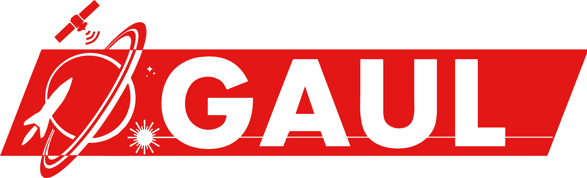

# GAUL - Groupe Aérospatial de l'Université Laval



## Guide de développement du site web

URL : https://gaulspace.web.app

### Téléchargements et installations nécessaires
* NodeJS: https://nodejs.org/en/
* Git: https://git-scm.com/
* Angular CLI: 
```
npm install -g @angular/cli
```

### Cloner et travailler sur un serveur local
```
git clone https://github.com/ul-gaul/website.git
```
```
cd website
```
```
npm install
```
```
ng serve --open
```

### Images (Assets)
* Importer des images en format ".webp".
* Les logos de partenaires sont de dimension 800 x 450 pixels.
* Classer les images dans les différents sous-dossiers de "Assets".
* Nomenclature des images: nom évocateur, lettres minuscules, mots séparés d'un "-". (Pour les logos, toujours ajouter "logo-" comme préfixe)

### Concernant la manipulation d'images
* Converstion de fichier et redimensionnement: https://www.iloveimg.com/fr
* Équivalent en ligne de Photoshop: https://www.photopea.com/

### Questions et soutien
L'application web est hébergée sur Google Firebase. Le compte utilisé présentement est un compte personnel.
Pour toutes questions relatives à l'hébergement ou au site web en général, communiquer avec Guillaume Landry.

## Crédits
Généré avec [Angular CLI](https://github.com/angular/angular-cli).
Basé sur un template par [Creative Tim](https://www.creative-tim.com/).
